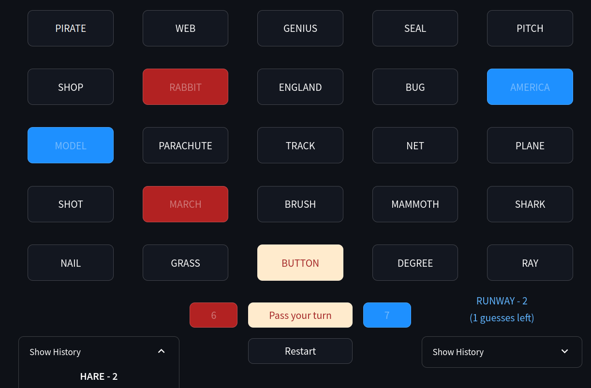

# Codenames Solo Practice

|  |  |
| ---- | ----------- |
|  | *A quick exercise on building streamlit apps and prompting the OpenAI API. For those times when you just want to play a quick Codenames game but have no one to play with :(* |
|   | Deployed via streamlit at [codenames-solo.streamlit.app/](https://codenames-solo.streamlit.app/) |

## Quickstart

  * Install requirements: `pip install openai streamlit`
    * Last tested with `openai==1.9.0` and `streamlit==1.31.1`
  * Setup an [OpenAI API key](https://openai.com/blog/openai-api) if you don't have one already
  * Launch the game
    * `streamlit run Game.py`

## ReadMe
### Gameplay
The app will first lead you through some basic configuration (*API key, model choice and language for the game's words*). After this, the game will start: You play as the spy(ies), while the API queries emulate both spymasters. If you need a refresher, you can find the [official rules of Codenames here](https://czechgames.com/files/rules/codenames-rules-en.pdf).

### Settings
Do you find the model to be a bad spymaster (*it does tend to be a bit repetitive*) ? Do you love prompt engineering ? Well you can improve/customize how the API is queried from the options on Settings page. Specifically, you can edit:
  * The base **system instruction**; useful to customize the high-level spymaster behavior, e.g. its language.
  * The **prompt used to query for a hint**. The prompt should inclde the special keywords `{SLF}`, `{OPP}`, `{NTR}` and `{KLL}`, acting as placeholder for the spymaster's cards, opponent team's cards, bystander cards, and assasin card respectively
  * The **sampling temperature** for generating hints
  * The **words list** from which the cards on the board are drawn. You can load the default language list for several languages

### Some extension Ideas
  * Reverse role (play as the spymaster)
  * Engineer prompts for finer control on the spymaster's play style
  * Codenames Pictures ?

## Credits
  * Codenames is a game by Vlaada Chvátil published by Czech Games Edition, and a well-know party games classic by now. It also has an [official (multiplayer) online version](https://codenames.game/).
  * [Streamlit](https://streamlit.io/) is a simple and fun framework for app-building in python
  * https://github.com/jporter-dev/codenames for the multi-language words list.
  * `Dall-E 3` (and all the data it has been trained on) for the logo